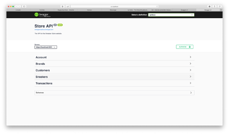
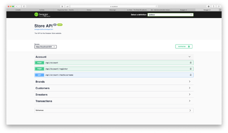
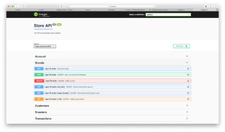
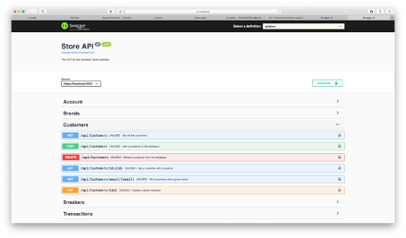
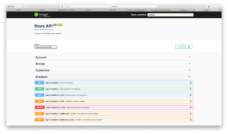
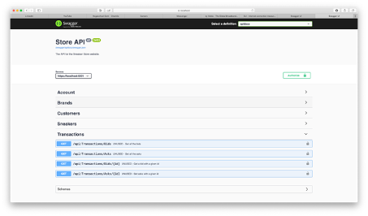
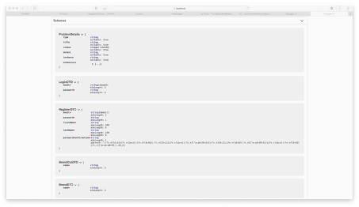
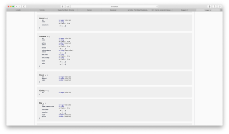
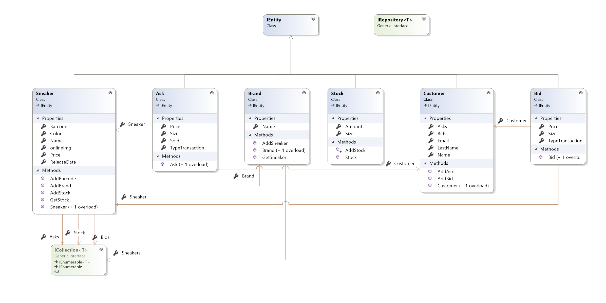

# StoreAPI - Ziggy Moens - 2B1

## API user:
| Username | Password | Role |
| :---: | :---:| :---: |
| admin@hotmail.com | P@ssword1 | admin |
| customer@hotmail.com | P@ssword1 | customer |

The accounts are created in [here](StoreAPI/Data/DataInitializer.cs)

## Swagger printscreens

## DCD

## Settings
 In order for the backend to run you must check if the connection string in [appsettings.json](StoreAPI/appsettings.json).

## Realisations

### Domain
- [x] Het domein bevat minstens 2 geassocieerde klassen
- [x] Klassen bevatten toestand en gedrag
- [x] Klassendiagram is aangemaakt, toont de properties, methodes en de associaties

### Data
- [x] DataContext is aangemaakt
- [x] Mapping is geïmplementeerd (In DataContext zoals in Recipe REST API voorbeeld, of a.d.h.v. Mapper klassen)
- [x] Databank wordt geseed met data (In DataContext zoals in Recipe REST API voorbeeld, of via initializer)

### Controller
- [x] Minstens 1 controller met endpoints voor de CRUD operaties
- [x] Mapping is geïmplementeerd (In DataContext zoals in Recipe REST API voorbeeld, of a.d.h.v. Mapper klassen)
- [x] Databank wordt geseed met data (In DataContext zoals in Recipe REST API voorbeeld, of via initializer)

### Swagger
- [x] De documentatie is opgesteld

## Hierarchy
* Controllers
  * [AccountController.cs](StoreAPI/Controllers/AccountController.cs)
  * [BrandController.cs](StoreAPI/Controllers/BrandsController.cs)
  * [CustomerController.cs](StoreAPI/Controllers/CustomersController.cs)
  * [SneakerController.cs](StoreAPI/Controllers/SneakersController.cs)
  * [TransactionsController.cs](StoreAPI/Controllers/TransactionsController.cs)
* Data
  * Mappers
    * [BrandConfiguration.cs](StoreAPI/Data/Mappers/BrandConfiguration.cs)
    * [CustomerConfiguration.cs](StoreAPI/Data/Mappers/CustomerConfiguration.cs)
    * [SneakerConfiguration.cs](StoreAPI/Data/Mappers/SneakerConfiguration.cs)
  * Repositories
    * [AskRepository.cs](StoreAPI/Data/Repositories/AskRepository.cs)
      * Inherits from IRepository\<T>, where T = Ask
    * [BidRepository.cs](StoreAPI/Data/Repositories/BidRepository.cs)
      * Inherits from IRepository\<T>, where T = Bid 
    * [BrandRepository.cs](StoreAPI/Data/Repositories/BrandRepository.cs)
      * Inherits from IRepository\<T>, where T = Brand
    * [CustomerRepository.cs](StoreAPI/Data/Repositories/CustomerRepository.cs)
      * Inherits from IRepository\<T>, where T = Customer
    * [SneakerRepository.cs](StoreAPI/Data/Repositories/CustomerRepository.cs)
      * Inherits from IRepository\<T>, where T = Sneaker
* DTO
  * [BrandDTO.cs](StoreAPI/DTO/BrandDTO.cs)
  * [CustomerDTO.cs](StoreAPI/DTO/CustomerDTO.cs)
  * [LoginDTO.cs](StoreAPI/DTO/LoginDTO.cs)
  * [RegisterDTO.cs](StoreAPI/DTO/RegisterDTO.cs)
  * [SneakerDTO.cs](StoreAPI/DTO/SneakerDTO.cs)
  * [SneakerOutDTO.cs](StoreAPI/DTO/SneakerOutDTO.cs)
  * [StockDTO.cs](StoreAPI/DTO/StockDTO.cs)
* Models
  * Interfaces
    * [IEntity.cs](StoreAPI/Models/Interfaces/IEntity.cs)
    * [IRepository.cs](StoreAPI/Models/Interfaces/IRepository.cs)
  * [Ask.cs](StoreAPI/Models/Ask.cs)
    * Inherits from IEntity
  * [Bid.cs](StoreAPI/Models/Bid.cs)
    * Inherits from IEntity
  * [Brand.cs](StoreAPI/Models/Brand.cs)
    * Inherits from IEntity
  * [Customer.cs](StoreAPI/Models/Customer.cs)
    * Inherits from IEntity
  * [Sneaker.cs](StoreAPI/Models/Sneaker.cs)
    * Inherits from IEntity
  * [Stock.cs](StoreApi/Models/Stock.cs)
    * Inherits from IEntity

* [Program.cs](StoreAPI/Program.cs)
* [StartUp.cs](StoreAPI/StartUp.cs)

